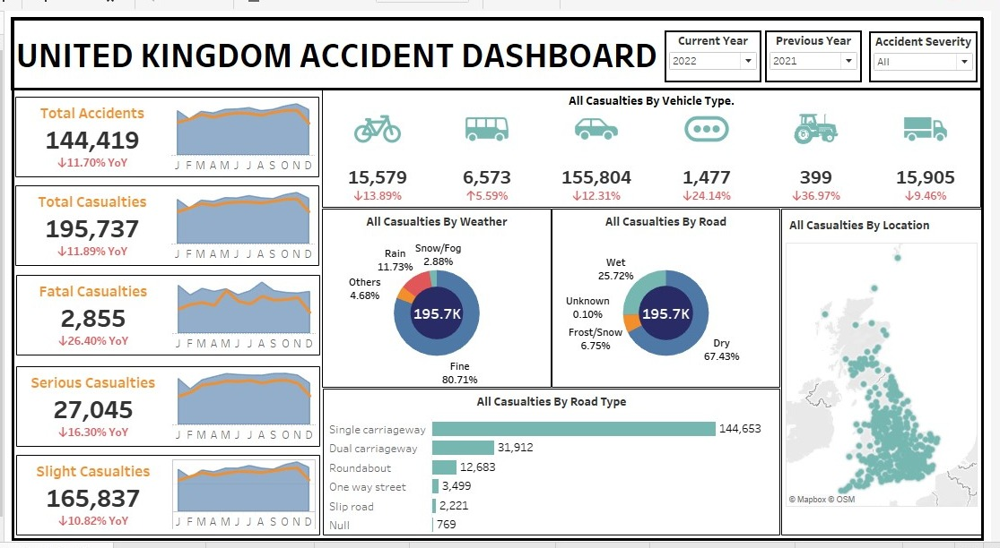

 🚗 UK Road Accident Analysis

This project explores car accidents and population demographics in the United Kingdom using real-world datasets. It combines data analysis in Python, interactive D3.js visualizations, and a Tableau dashboard to draw key insights and road safety recommendations.

📁 Project Structure

| Folder         | Contents                                        |
|----------------|-------------------------------------------------|
| `datasets/`    | Raw and processed `.csv` files used for analysis |
| `code/`        | Jupyter notebook with sample EDA                 |
| `reports/`     | Final report and D3 visualization output         |
| `tableau/`     | Tableau workbook file                            |
| Root folder    | HTML dashboard and dashboard image preview       |

🧠 Key Insights

- Urban areas have higher accident rates but lower severity.
- Most accidents happen on Mondays and under poor weather/light conditions.
- Higher population density correlates with frequent but less severe accidents.

🛠️ Tools Used

- Python (`pandas`, `seaborn`, `matplotlib`)
- D3.js (interactive data visualizations)
- Tableau (dashboard building)
- Visual Studio Code Representation (to host D3.js)

 📊 Dashboard Preview

 🌐 Visualizations

Open the `index.html` file in your browser to view interactive D3.js charts (bar, pie, histogram, grouped, donut, etc.).

 📚 Reports

- `Analysis of Car Accidents Final1.pdf`
- `D3.JS results.pdf`

 📓 Notebook Preview

- Load and explore accident data
- Analyze casualties by weather condition
- Identify missing values
